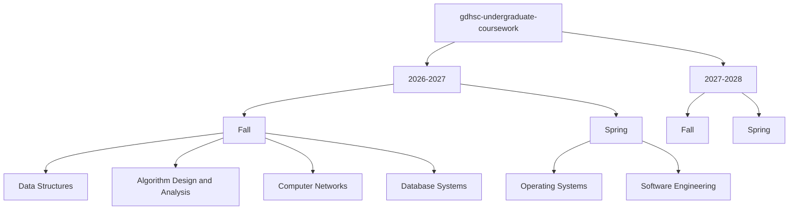
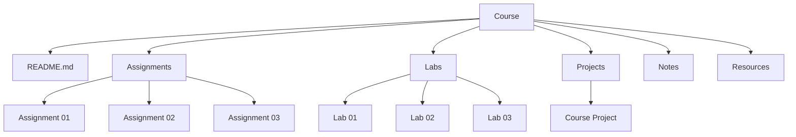
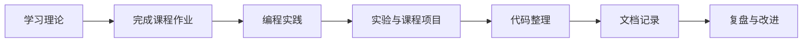
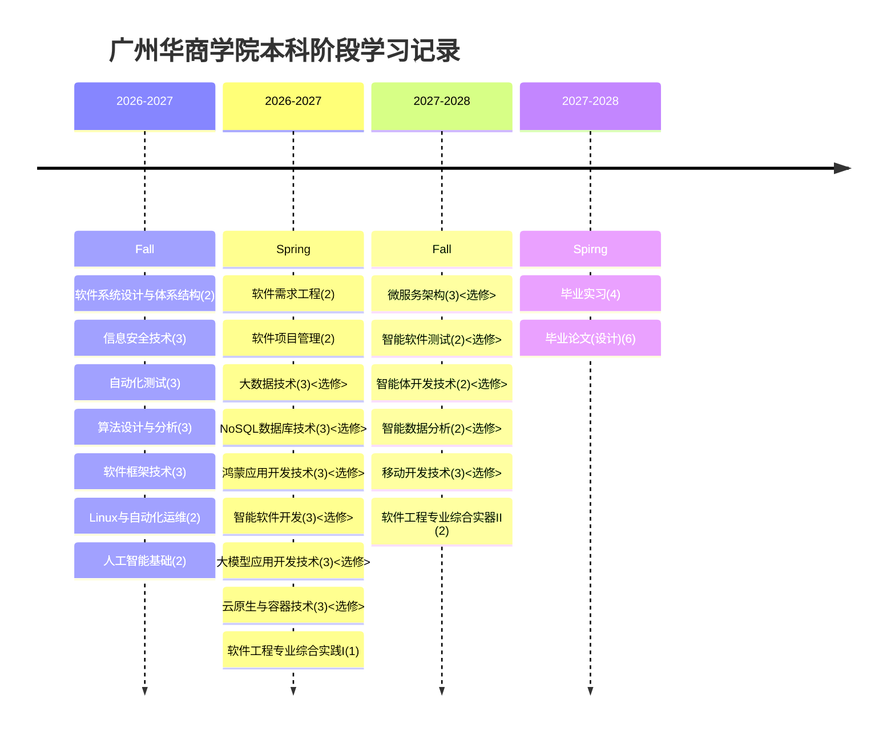

# 广州华商学院本科课程学习

> 广州华商学院本科阶段的课程作业、实验、课程设计与学习资料归档。

这个仓库用于记录和整理我在**广州华商学院本科阶段**的学习过程。

这里将持续收录各门课程的课程作业、实验报告、编程实践、课程设计、课程项目、学习笔记以及其他与课程学习相关的资料。

这个仓库不仅用于完成课程要求，也希望通过长期维护，完整记录自己的本科阶段学习轨迹。

------

## 📚 仓库内容

主要包括以下内容：

- 📖 课程学习资料
- 📝 课程作业
- 💻 编程作业
- 🧪 实验与实验报告
- 🏗️ 课程设计
- 🚀 课程项目
- 📒 学习笔记
- 📊 实验数据与结果
- 🔧 项目配置及相关文件

------

## 📂 目录结构

仓库按照 **学年 → 学期 → 课程** 进行组织。



单门课程根据实际情况进一步划分：



------

## 🎓 学习阶段

| Academic Year | Semester | Status   |
| ------------- | -------- | -------- |
| 2026–2027     | Fall     | 🚧 进行中 |
| 2026–2027     | Spring   | ⏳ 待开始 |
| 2027–2028     | Fall     | ⏳ 待开始 |
| 2027–2028     | Spring   | ⏳ 待开始 |

> 随着本科阶段学习的推进持续更新。

------

## 📋 Course Projects

对于规模较大的课程项目，将按照独立项目进行管理。

例如：

```text
course-project/
├── README.md
├── docs/
├── src/
├── tests/
└── ...
```

课程项目的 `README.md` 中会尽可能记录：

- 项目背景
- 项目需求
- 功能说明
- 技术栈
- 系统架构
- 项目结构
- 使用方式
- 实验结果
- 项目总结

------

## 🧑‍💻 学习方式

我希望将课程学习从单纯的“完成作业”逐渐转变为更加完整的软件工程实践。



对于一些具有实际开发价值的课程项目，也会尝试采用 Git、测试、代码规范、项目文档等工程化方式进行管理。

------

## 📌 Repository Convention

### Directory Naming

课程目录优先使用课程的**英文名称**：

```text
data-structures/
algorithm-design-and-analysis/
computer-networks/
database-systems/
operating-systems/
software-engineering/
```

课程内部目录统一使用英文：

```text
assignments/
labs/
projects/
notes/
resources/
```

例如：

```text
data-structures/
├── README.md
├── assignments/
│   ├── assignment-01/
│   ├── assignment-02/
│   └── assignment-03/
│
├── labs/
│   ├── lab-01/
│   ├── lab-02/
│   └── lab-03/
│
├── projects/
│   └── course-project/
│
├── notes/
│
└── resources/
```

### Commit

尽量使用清晰明确的 Commit Message。

例如：

```text
feat: add data structures assignment 01
feat: complete computer networks lab 02
docs: add operating systems lab report
refactor: refactor course project structure
fix: fix authentication issue in course project
```

------

## ⚠️ 学术诚信

本仓库主要用于个人学习记录与课程资料归档。

仓库中的部分内容可能涉及：

- 教师提供的课程材料
- 课程模板
- 实验要求
- 课程题目
- 第三方资料

使用相关内容时应遵守学校的课程规定、知识产权要求以及学术诚信规范。

**不得直接将本仓库中的作业、代码或报告作为他人的课程作业提交。**

------

## 📈 本科四年学习记录

这个仓库会随着本科阶段的学习持续更新。

从第一次课程作业，到实验、课程设计，再到毕业设计，希望这里最终能够形成一份完整的本科学习档案。



> 注:第二学期选修12学分，第三学期选修7学分

------

## ⭐ Repository

| 项目   | 信息               |
| ------ | ------------------ |
| 学校   | 广州华商学院       |
| 阶段   | 本科               |
| 用途   | 课程学习与资料归档 |
| 维护者 | Siborne            |

> **记录课程学习，积累实践成果，保存本科阶段的学习轨迹。**